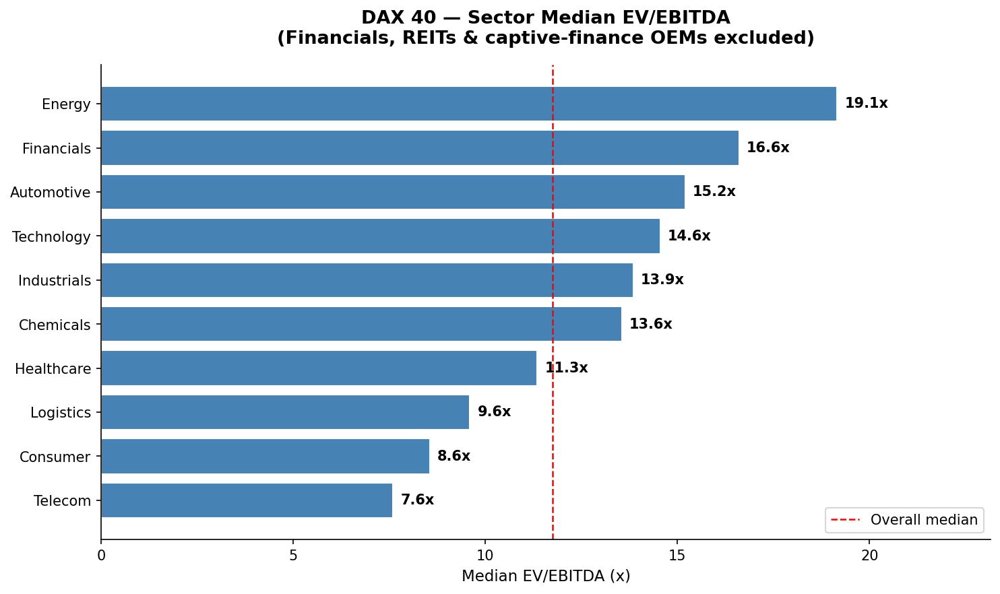
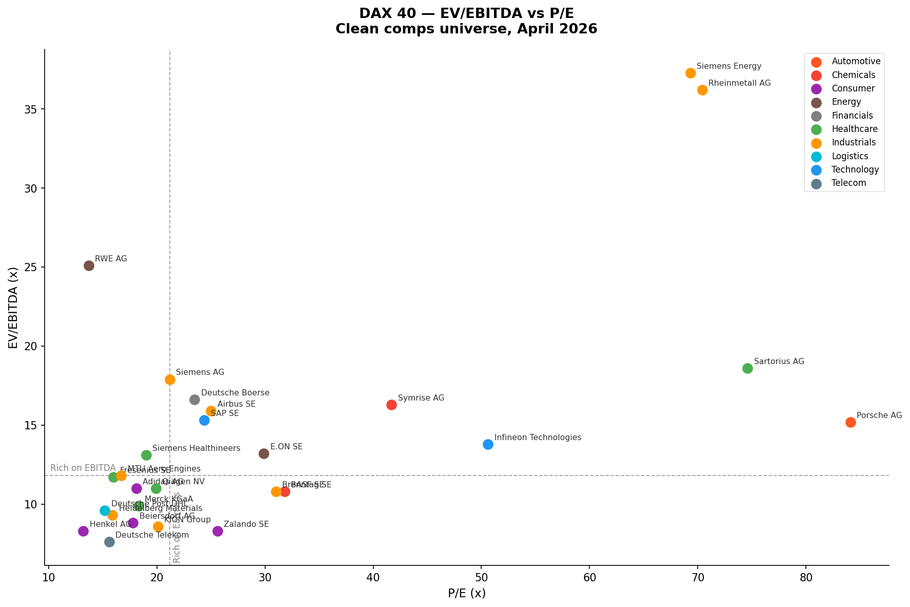

# DAX40 Trading Comps Dashboard 🇩🇪

> A live trading comparables analysis of all 40 companies in Germany's DAX index — covering EV/EBITDA, EV/Revenue, and P/E multiples pulled directly from Yahoo Finance via yfinance.

**Author:** Shardul Pundir
**Background:** MSc Finance, WHU Otto Beisheim School of Management (2026 intake) | CFA Level I
**LinkedIn:** [linkedin.com/in/shardulpundir](https://linkedin.com/in/shardulpundir)

---

## Project Overview

Trading comparables ("trading comps") are one of the three core valuation methodologies in Investment Banking and Asset Management — alongside DCF and Precedent Transaction analysis. This project builds a live, reproducible comps table for the entire DAX40 universe, pulling real-time market data via the Yahoo Finance API.

**What it produces:**
- A full trading comps table for all 40 DAX companies (EV/EBITDA, EV/Revenue, P/E), sorted by sector
- Sector median EV/EBITDA bar chart
- Individual company scatter plot (EV/EBITDA vs P/E — identifying cheap vs. expensive names)
- Exported CSV of all multiples
- Markdown commentary on key observations

---

## Data & Methodology

| Item | Detail |
|------|--------|
| **Data source** | Yahoo Finance via `yfinance` (live market data) |
| **Universe** | All 40 DAX index constituents (as of April 2026) |
| **Key multiples** | EV/EBITDA, EV/Revenue, P/E (trailing twelve months) |
| **EV/EBITDA method** | Uses `enterpriseToEbitda` directly from Yahoo Finance; manual calc (EV ÷ EBITDA) as fallback |
| **Note on financials** | Banks (Deutsche Bank, Commerzbank, Munich Re) show no EV/EBITDA — correct, as this metric is not applicable to financials. P/Book is the standard multiple for these. |
| **Prices** | April 2026 market prices |

---

## Repository Structure

```
dax40-trading-comps/
│
├── DAX40_Trading_Comps.ipynb     # Main notebook — run top to bottom
├── dax40_trading_comps_april2026.csv   # Exported comps table
├── dax40_sector_medians.png      # Sector EV/EBITDA bar chart
├── dax40_scatter.png             # EV/EBITDA vs P/E scatter plot
├── requirements.txt
└── README.md
```

---

## Setup & Running

### Prerequisites
- Python 3.9+ (Anaconda recommended)
- Jupyter Notebook / JupyterLab

### Install dependencies
```bash
pip install yfinance pandas matplotlib
```

Or with conda:
```bash
conda install -c conda-forge yfinance pandas matplotlib
```

### Run the notebook
```bash
jupyter notebook DAX40_Trading_Comps.ipynb
```

Run all cells top to bottom. The notebook pulls live data — prices and multiples update each time you run it.

---

## Key Outputs

### Sector Median EV/EBITDA


### EV/EBITDA vs P/E Scatter


---

## Skills Demonstrated

`Python` `yfinance` `pandas` `matplotlib` `Trading Comps` `EV/EBITDA` `Valuation` `DAX40` `German Equities` `Data Pipeline`

---

## Context

Trading comps are the starting point of almost every IB pitch book and AM research note. The ability to pull, clean, and present a comps table cleanly — and to know *why* certain multiples don't apply to certain sectors — is a core technical skill for anyone targeting finance roles in Europe.

This project demonstrates that skill applied to Germany's 40 largest listed companies, which are the most relevant universe for roles at Frankfurt-based banks, asset managers, and M&A boutiques.

---
