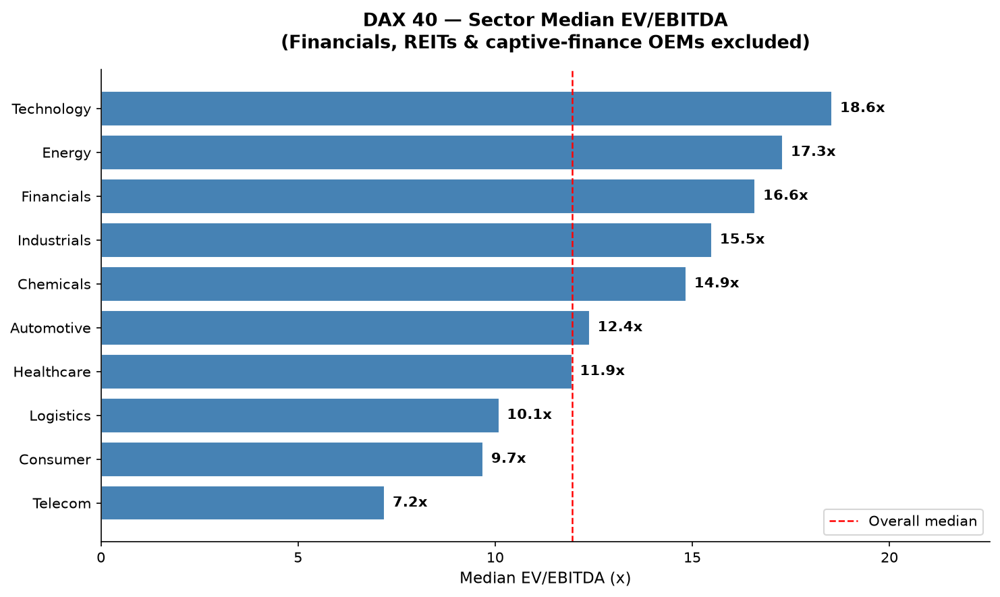
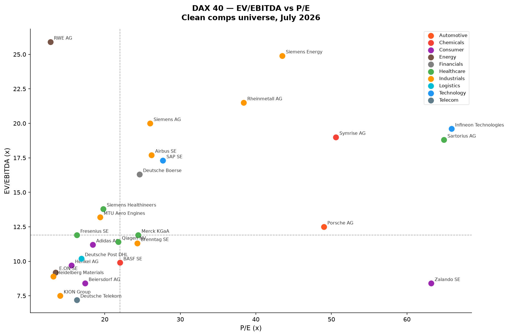

# DAX40 Trading Comps Dashboard 🇩🇪

> A live trading comparables analysis of all 40 companies in Germany's DAX index — covering EV/EBITDA, EV/Revenue, and P/E multiples pulled directly from Yahoo Finance via yfinance.

**Author:** Shardul Pundir
**Background:** MSc Finance, WHU Otto Beisheim School of Management (2026 intake) | CFA Level I
**LinkedIn:** [linkedin.com/in/shardulpundir](https://linkedin.com/in/shardulpundir)

**Data last refreshed:** July 2026 — updates automatically every Monday via GitHub Actions (see `.github/workflows/refresh.yml`), so the numbers here don't go stale.

---

## Project Overview

Trading comparables ("trading comps") are one of the three core valuation methodologies in Investment Banking and Asset Management — alongside DCF and Precedent Transaction analysis. This project builds a live, reproducible comps table for the entire DAX40 universe, pulling real-time market data via the Yahoo Finance API.

**What it produces:**
- A full trading comps table for all 40 DAX companies (EV/EBITDA, EV/Revenue, P/E), sorted by sector
- Sector median EV/EBITDA bar chart
- Individual company scatter plot (EV/EBITDA vs P/E — identifying cheap vs. expensive names)
- Exported CSV of all multiples
- Markdown commentary on key observations

---

## Data & Methodology

| Item | Detail |
|------|--------|
| **Data source** | Yahoo Finance via `yfinance` (live market data) |
| **Universe** | All 40 DAX index constituents |
| **Key multiples** | EV/EBITDA, EV/Revenue, P/E (trailing twelve months) |
| **EV/EBITDA method** | Uses `enterpriseToEbitda` directly from Yahoo Finance; manual calc (EV ÷ EBITDA) as fallback |
| **Note on financials** | Banks (Deutsche Bank, Commerzbank, Munich Re) show no EV/EBITDA — correct, as this metric is not applicable to financials. P/Book is the standard multiple for these. |
| **Prices** | Live at last refresh (see date above) — re-pulled automatically weekly |
| **Refresh mechanism** | `refresh_data.py` re-pulls all 40 tickers and regenerates the CSV + both charts; a scheduled GitHub Action runs it every Monday and commits any changes automatically |

---

## Repository Structure

```
dax40-trading-comps/
│
├── DAX40_Trading_Comps.ipynb        # Original interactive notebook — run top to bottom
├── refresh_data.py                  # Standalone script — same logic, run by CI on a schedule
├── .github/workflows/refresh.yml    # Weekly automated refresh (GitHub Actions)
├── dax40_trading_comps_*.csv        # Exported comps table (most recent month is canonical)
├── dax40_sector_medians.png         # Sector EV/EBITDA bar chart
├── dax40_scatter.png                # EV/EBITDA vs P/E scatter plot
├── requirements.txt
└── README.md
```

---

## Setup & Running

### Prerequisites
- Python 3.9+ (Anaconda recommended)
- Jupyter Notebook / JupyterLab

### Install dependencies
```bash
pip install yfinance pandas matplotlib
```

Or with conda:
```bash
conda install -c conda-forge yfinance pandas matplotlib
```

### Run the notebook
```bash
jupyter notebook DAX40_Trading_Comps.ipynb
```

Run all cells top to bottom. The notebook pulls live data — prices and multiples update each time you run it.

---

## Key Outputs

### Sector Median EV/EBITDA


### EV/EBITDA vs P/E Scatter


---

## Key Findings (as of latest refresh)

- **Widest sector dispersion:** Energy is the most expensive sector at a 33.2x median EV/EBITDA (driven by RWE at 56.6x — the market pricing in the renewables build-out well ahead of current earnings), against Telecom at the cheapest, 6.9x (Deutsche Telekom), a >26x spread across two DAX sectors.
- **Cheapest five names:** Deutsche Telekom (6.9x), KION Group (7.6x), Bayer AG (8.3x), Beiersdorf (8.9x), Heidelberg Materials (9.2x) — a mix of a litigation-overhang name (Bayer), a cyclical industrial trough (KION), and genuinely low-growth defensives (Telekom, Beiersdorf).
- **Most expensive five names:** RWE (56.6x), Siemens Energy (37.3x), Infineon (26.6x), Rheinmetall (25.8x), Siemens AG (23.0x) — three of the five are direct plays on Europe's energy-transition and defense-spending themes, suggesting the market is pricing thematic growth well above where trailing EBITDA currently sits.
- **Automotive vs Industrials:** Automotive's median (18.9x) now sits close to Industrials (18.2x) — a useful sanity check against the "German autos are structurally cheap" narrative; on this snapshot the sector isn't trading at a discount to industrial peers.

*(These figures move with each weekly refresh — treat the specific multiples above as a snapshot of the methodology's output, not a static claim; check the latest CSV for current numbers.)*

---

## Skills Demonstrated

`Python` `yfinance` `pandas` `matplotlib` `Trading Comps` `EV/EBITDA` `Valuation` `DAX40` `German Equities` `Data Pipeline`

---

## Context

Trading comps are the starting point of almost every IB pitch book and AM research note. The ability to pull, clean, and present a comps table cleanly — and to know *why* certain multiples don't apply to certain sectors — is a core technical skill for anyone targeting finance roles in Europe.

This project demonstrates that skill applied to Germany's 40 largest listed companies, which are the most relevant universe for roles at Frankfurt-based banks, asset managers, and M&A boutiques.

---

*Built as part of a finance portfolio in preparation for a career in Investment Banking and Asset Management in Europe.*
